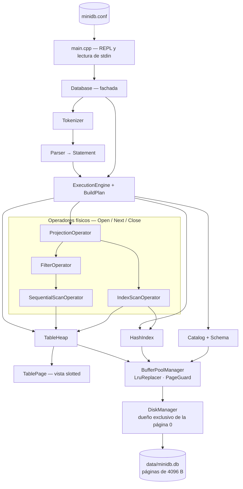

# Arquitectura de MiniDB

Documento técnico del sistema: capas, formato binario con offsets exactos,
invariantes y flujo de cada operación. Para instalar, compilar y usar el
sistema, véase [README.md](README.md).

## 1. Capas



| Clase | Responsabilidad | Archivo |
|---|---|---|
| `DiskManager` | Leer y escribir páginas completas, asignar y liberar `PageId`, lista de libres, validar la cabecera | `storage/disk_manager.*` |
| `BufferPoolManager` | Frames, page table, fijaciones, marca de sucia, escritura al desalojar, estadísticas | `buffer/buffer_pool_manager.*` |
| `LruReplacer` | Elegir la víctima entre los frames desfijados | `buffer/lru_replacer.*` |
| `PageGuard` | Desfijar por RAII | `buffer/buffer_pool_manager.hpp` |
| `TablePage` | Vista slotted sobre 4096 bytes: insertar, leer, actualizar, borrar, compactar | `storage/table_page.*` |
| `Record`, `Value` | Tupla lógica y su (de)serialización según el esquema | `storage/record.*`, `common/value.*` |
| `TableHeap` | Cadena de páginas de tabla, operaciones por `RecordId`, iterador de escaneo | `storage/table_heap.*` |
| `HashIndex` | `int32 → RecordId` en páginas físicas, buckets y overflow | `index/hash_index.*` |
| `Catalog`, `Schema` | Esquema y punteros raíz, persistidos en la página 1 | `catalog/*` |
| `Tokenizer`, `Parser` | Texto SQL → `Statement` | `parser/*` |
| `PhysicalOperator` y derivados | Modelo Volcano | `execution/*` |
| `ExecutionEngine` | Elegir el plan y aplicar las modificaciones | `execution/execution_engine.*` |
| `Database` | Ensamblar todo, ejecutar sentencias, sincronizar al cerrar | `database/database.*` |

## 2. Invariantes de dependencia

Reglas que sostienen el diseño. Se pueden comprobar sobre el código:

1. `DiskManager` no conoce `BufferPoolManager`: no hay ciclo.
2. `TableHeap`, `HashIndex` y `Catalog` no declaran ningún `DiskManager&` ni
   `std::fstream`; solo `BufferPoolManager&`.
   ```bash
   grep -rn "DiskManager\|fstream" src/storage/table_heap.cpp src/index/ src/catalog/
   ```
3. `HashIndex` no guarda ningún contenedor de entradas. Su único miembro de
   estado es `header_page_id_`.
   ```bash
   sed 's,//.*,,' include/minidb/index/hash_index.hpp | grep -E "unordered_map|vector<|map<"
   ```
4. Los operadores no conocen el Buffer Pool ni el disco.
   ```bash
   grep -rn "BufferPoolManager\|DiskManager" include/minidb/execution/*operator*.hpp
   ```
5. Solo el `DiskManager` toca la página 0.
   ```bash
   grep -rn "kFileHeaderPageId" src/ | grep -v disk_manager.cpp
   ```
6. El parser no incluye nada de `storage/`, `buffer/` ni `index/`.
7. `main.cpp` solo habla con `Database`.

Los siete greps devuelven vacío en el estado actual del repositorio.

## 3. Formato del archivo

Todo es **little-endian**, elegido explícitamente: es fijo entre plataformas y,
en x86, hace que un volcado con `xxd` se lea igual que los valores en el
depurador. Nada se escribe con `reinterpret_cast` de una estructura, porque el
relleno del compilador y los miembros no triviales se filtrarían al formato.

Offset de una página: `page_id * 4096`.

### 3.1 Tipos de página

| Valor | Tipo | Uso |
|---|---|---|
| 0 | `kInvalid` | — |
| 1 | `kFileHeader` | Página 0 |
| 2 | `kCatalog` | Página 1 |
| 3 | `kTableData` | Slotted page de registros |
| 4 | `kHashIndexHeader` | Directorio de buckets |
| 5 | `kHashBucket` | Bucket primario |
| 6 | `kHashOverflow` | Desbordamiento (mismo formato) |
| 7 | `kFree` | En la lista de páginas libres |

El byte 0 de toda página es su tipo, **salvo la página 0**, que empieza con el
número mágico para que `file` y `xxd` identifiquen el archivo de un vistazo.

### 3.2 Página 0 — cabecera del archivo

| Offset | Bytes | Campo | Valor |
|---|---|---|---|
| 0 | 4 | `magic_number` | `0x444E494D`, se lee `MIND` en disco |
| 4 | 2 | `format_version` | 1 |
| 6 | 2 | `page_size` | 4096 |
| 8 | 4 | `page_count` | páginas totales |
| 12 | 4 | `free_page_head` | cabeza de la lista libre, o `0xFFFFFFFF` |
| 16 | 4 | `catalog_page_id` | 1 |
| 20 | 4076 | relleno a cero | |

**20 ≤ 4096.** Al abrir se validan el número mágico, la versión, el tamaño de
página, que el archivo mida un múltiplo de 4096 y que `page_count` coincida con
la longitud real. Cualquier discrepancia lanza una excepción; nunca se continúa
en silencio.

### 3.3 Página 1 — catálogo

| Offset | Bytes | Campo |
|---|---|---|
| 0 | 1 | `page_type` = `kCatalog` |
| 1 | 1 | `table_count` (0 o 1) |
| 2 | 2 | `column_count` |
| 4 | 2 | `primary_key_index` |
| 6 | 2 | reservado |
| 8 | 4 | `first_table_page_id` |
| 12 | 4 | `last_table_page_id` |
| 16 | 4 | `index_header_page_id` |
| 20 | 8 | `record_count` |
| 28 | 2+32 | `table_name` (longitud + bytes) |
| 62 | ≤ 8×38 | columnas, a paso fijo de 38 bytes |

Cada columna: 2 bytes de longitud + hasta 32 de nombre + 1 de tipo + 2 de
longitud máxima + 1 de banderas.

Máximo: `28 + 34 + 8×38 = 366 bytes`. **366 ≤ 4096.**

Al releerlo, el esquema se reconstruye pasando por el constructor de `Schema`,
que revalida todo: un catálogo corrupto se rechaza al abrir y no mucho después.

### 3.4 Páginas de tabla — slotted page

```
0        12                 free_space_begin      free_space_end      4096
|--------|------------------|---------------------|-------------------|
 cabecera   directorio slots      espacio libre      datos de registros
            (crece ->)                                  (<- crece)
```

Cabecera, 12 bytes:

| Offset | Bytes | Campo |
|---|---|---|
| 0 | 1 | `page_type` = `kTableData` |
| 1 | 1 | reservado |
| 2 | 2 | `slot_count` — longitud del directorio |
| 4 | 2 | `record_count` — registros vivos |
| 6 | 2 | `free_space_end` — byte más bajo ocupado por datos |
| 8 | 4 | `next_page_id` |

`free_space_begin` **no se almacena**: vale siempre `12 + 4 * slot_count`. Un
campo duplicado sería un invariante más que puede desincronizarse. Lo mismo pasa
con el identificador de la página (se conoce al pedirla) y con un puntero a la
página anterior (no se desenlazan páginas de tabla).

Entrada del directorio, 4 bytes: `offset` (2) y `size` (2).

> **Centinela:** `offset == 0` significa slot libre. El offset 0 es imposible
> para datos reales porque la cabecera ocupa los bytes 0..11. Así se ahorra un
> byte de estado por slot, y «nunca usado» y «borrado» se unifican en un único
> estado reutilizable.

**Invariante:** `free_space_begin ≤ free_space_end`, y todo slot ocupado apunta
dentro de `[free_space_end, 4096)`.

### 3.5 Registros

El formato lo dicta el `Schema`; el registro no lleva etiquetas de tipo ni
número de columnas, porque el esquema ya está en el catálogo y duplicarlo en
cada fila sería malgastar espacio y crear una segunda fuente de verdad.

| Tipo | Bytes |
|---|---|
| `INT` | 4, complemento a dos |
| `VARCHAR(n)` | 2 de longitud + esa cantidad de bytes UTF-8 |

Para `students(id INT, name VARCHAR(50), age INT, career VARCHAR(50))`:

- Máximo: `4 + (2+50) + 4 + (2+50) = 112` bytes.
- Fila de la demo `(1,'Ana',20,'Ciencia de la Computación')`:
  `4 + (2+3) + 4 + (2+26) = 41` bytes.

> `VARCHAR(n)` limita **bytes**, no caracteres. `'Ciencia de la Computación'`
> son 25 caracteres y 26 bytes. Confundirlos es un error latente garantizado con
> datos en español.

### 3.6 Comprobación de capacidad

Restricción: `12 + 4·n + Σ tamaños ≤ 4096`, es decir `4·n + Σ ≤ 4084`.

| n registros de 112 B | directorio | datos | suma | + cabecera | ¿cabe? |
|---|---|---|---|---|---|
| 34 | 136 | 3808 | 3944 | 3956 | sí |
| **35** | 140 | 3920 | 4060 | **4072** | **sí** |
| 36 | 144 | 4032 | 4176 | 4188 | no |

**35 registros por página** en el peor caso; unos 90 con las filas de la demo.

- Registro individual mayor posible en página vacía: `4096 − 12 − 4 = 4080`.
- Cota del sistema: 8 columnas × (2 + 255) = **2056 ≤ 4080**. Es decir, *ningún
  registro válido puede no caber en una página vacía*. La comprobación se
  mantiene igualmente, pero no puede dispararse.

### 3.7 Índice hash

Cabecera:

| Offset | Bytes | Campo |
|---|---|---|
| 0 | 1 | `page_type` = `kHashIndexHeader` |
| 1 | 1 | reservado |
| 2 | 2 | `bucket_count` = 16 |
| 4 | 2 | `bucket_capacity` = 408 |
| 6 | 2 | reservado |
| 8 | 4 | `entry_count` |
| 12 | 4×buckets | `bucket_page_ids[]` |

Buckets máximos: `(4096 − 12) / 4 = 1021`. Con 16: `12 + 64 = 76 ≤ 4096`.

Bucket y overflow comparten formato:

| Offset | Bytes | Campo |
|---|---|---|
| 0 | 1 | `page_type` (`kHashBucket` o `kHashOverflow`) |
| 1 | 1 | reservado |
| 2 | 2 | `entry_count` |
| 4 | 4 | `overflow_page_id`, o `0xFFFFFFFF` |
| 8 | 10×entradas | entradas |

Entrada, 10 bytes: `key` (int32), `page_id` (uint32), `slot_id` (uint16). No
lleva byte de estado, porque el borrado mueve la última entrada al hueco en vez
de dejar una lápida.

Capacidad: `(4096 − 8) / 10 = 408,8 → 408` entradas.
Comprobación: `8 + 408×10 = 4088 ≤ 4096`.

`bucket_capacity` se persiste en lugar de estar fijada en el código. En
producción se usan las 408 entradas que caben; las pruebas crean índices
diminutos para ejercitar cadenas de overflow profundas en milisegundos en vez de
necesitar miles de inserciones.

**Función hash.** Multiplicativa de Knuth:

```cpp
uint32_t HashKey(int32_t key) {
    return static_cast<uint32_t>(key) * 2654435761u;
}
bucket = HashKey(key) % bucket_count;
```

No se usa `std::hash` porque está definida por la implementación —es la
identidad en libstdc++—, de modo que una base creada con una biblioteca estándar
no podría leerse con otra.

### 3.8 Lista de páginas libres

Intrusiva, sin páginas adicionales: la cabeza vive en la página 0 y cada página
liberada apunta a la siguiente.

| Offset | Bytes | Campo |
|---|---|---|
| 0 | 1 | `page_type` = `kFree` |
| 1 | 3 | reservado |
| 4 | 4 | `next_free_page_id` |

**8 ≤ 4096.** Su consumidor real son las páginas de overflow que se vacían tras
una tanda de borrados: se desenlazan y vuelven aquí, así que el archivo deja de
crecer.

### 3.9 Disposición tras `CREATE TABLE`

| PageId | Tipo |
|---|---|
| 0 | Cabecera del archivo |
| 1 | Catálogo |
| 2 | Cabecera del índice |
| 3–18 | 16 buckets |
| 19 | Primera página de datos |

**20 páginas × 4096 = 81 920 bytes.** Como 20 páginas superan los 8 frames del
Buffer Pool, el reemplazo LRU se observa desde la demostración más pequeña.

## 4. Buffer Pool

| Elemento | Diseño |
|---|---|
| Frames | Vector de tamaño fijo. Cada uno: `page_id`, 4096 bytes, `pin_count`, `is_dirty`, `is_occupied` |
| Page table | `unordered_map<PageId, FrameId>`, búsqueda O(1) |
| Lista de libres | Frames nunca usados; se consumen antes de desalojar |
| Reemplazo | LRU: `list<FrameId>` + `unordered_map` al iterador. Frente = más reciente, final = víctima |

- `FetchPage` incrementa la fijación y registra el acceso; si la página no está
  residente toma un frame libre o desaloja el menos usado recientemente.
- `NewPage` asigna una página y la entrega a cero sin leerla del disco.
- `UnpinPage(id, is_dirty)` reduce la fijación; al llegar a cero el frame pasa a
  ser candidato.
- `FlushPage` y `FlushAllPages` escriben sin desalojar.
- Si no hay víctima disponible se lanza una excepción, en vez de devolver un
  puntero nulo que alguien acabaría desreferenciando.

**Dos detalles decisivos.** La marca de sucia se borra únicamente *después* de
que la escritura haya tenido éxito, y se acumula entre desfijaciones: un lector
que desfija limpiamente no puede borrar el hecho de que otro modificó la página.

**Pico de fijaciones simultáneas.** El camino más costoso es un `UPDATE` con
reubicación: cabecera del índice (1) + bucket (1) + overflow (1) + página origen
(1) + página destino (1) + catálogo (1) = **6 < 8**.

## 5. Flujo de las operaciones

### INSERT

1. El parser produce un `InsertStatement`.
2. Se valida contra el esquema: número de valores, tipos, longitud en bytes.
3. Se extrae la clave primaria.
4. **Se consulta el índice antes de tocar la tabla**, para que una clave
   duplicada la deje exactamente como estaba.
5. `TableHeap::InsertRecord` busca hueco: primero en la última página (el caso
   habitual al ir añadiendo), después recorriendo la cadena para aprovechar el
   espacio que dejaron los borrados, y solo entonces crea una página.
6. `HashIndex::Insert` registra `clave → RecordId`. Si falla, se deshace la
   inserción en la tabla: es el único punto del sistema donde se compensa, y
   existe porque sin él la tabla guardaría un registro que el índice no
   encuentra.
7. Se incrementa el contador del catálogo.

### SELECT sin WHERE

`Projection(SequentialScan)`. El escaneo recorre la cadena de páginas y devuelve
un registro por llamada a `Next`. No mantiene ninguna página fijada entre
llamadas: cada paso la pide, la lee y la suelta.

### SELECT por clave primaria

`Projection(IndexScan)`. Se calcula el bucket, se recorre la cadena comparando
claves y se recupera el registro por su `RecordId`. Como la clave es única, el
operador entrega como mucho una fila y no necesita filtro encima.

### SELECT con filtro no indexado

`Projection(Filter(SequentialScan))`. El filtro tira de su hijo en bucle hasta
encontrar una coincidencia, así que tampoco materializa nada.

### UPDATE

**Fase 1.** Se construye el mismo árbol que usaría un `SELECT` con ese `WHERE`,
se recorre entero recogiendo los `RecordId` y **se cierra**.

**Fase 2.** Con el escaneo ya cerrado, se aplican los cambios. Si el registro
crece y no cabe, `TablePage` intenta en el sitio, luego el hueco libre, luego
compactar; si aun así no entra, `TableHeap` lo reubica en otra página y devuelve
un `RecordId` distinto, momento en el que **el índice se repunta**.

Las dos fases no son un detalle de estilo: reescribir páginas mientras un
escaneo las recorre invalidaría los offsets de los que depende.

### DELETE

Igual, en dos fases. Se lee la clave primaria *antes* de borrar el registro, se
libera el slot, se quita la entrada del índice y se decrementa el contador.

La página no se desenlaza de la cadena aunque quede vacía: se reutiliza en la
siguiente inserción, con lo que el archivo no crece y no hace falta un puntero a
la página anterior.

### Cierre y reapertura

Al cerrar —`.exit`, fin de la entrada estándar o destrucción de `Database`— se
sincroniza el catálogo, se escriben todas las páginas sucias y se vuelca el
archivo. Que ocurra en el destructor es lo que hace que
`minidb data.db < script.sql` persista cuando la entrada simplemente se acaba.

Al reabrir se valida la cabecera, se lee el catálogo y se reconstruyen la tabla
y el índice a partir de sus punteros raíz. **No se reconstruye ningún índice en
memoria**: sus entradas ya están en las páginas.

## 6. Manejo de errores

Dos jerarquías, con intenciones distintas:

- `QueryError`: lo que el usuario puede provocar y corregir —SQL inválido, clave
  duplicada, valor demasiado largo, tabla inexistente—. La CLI lo informa y
  sigue.
- `StorageError`: archivo corrupto o incompatible, lectura o escritura
  incompleta, invariante interna violada. No es culpa del usuario y no se puede
  continuar.

`main` distingue ambas y termina con códigos distintos (1, 2 y 3 para lo
inesperado).

## 7. Limitaciones y decisiones conscientes

| Decisión | Motivo |
|---|---|
| Una sola tabla | Un catálogo con lista de tablas, una tabla y un índice por cada una, y resolución de nombres en el motor añadirían superficie de fallo sin cambiar nada de lo que demuestran las capas de almacenamiento, buffer e índice |
| Sin WAL | La durabilidad ante una terminación abrupta queda fuera del alcance. Se documenta en lugar de simularse con un mecanismo de compensación genérico, que sería una falsa sensación de seguridad |
| Sin operadores de inserción, actualización y borrado | El modelo Volcano describe iteradores que producen tuplas; una sentencia cuya única salida es un contador no encaja. Siguen usando el pipeline para localizar sus filas |
| Número de buckets fijo | El hash extensible cambiaría el índice entero para absorber un crecimiento que las páginas de overflow ya manejan |
| No se puede actualizar la clave primaria | Obligaría a reescribir la entrada del índice bajo otra clave, con un caso intermedio en el que la fila no es localizable |
