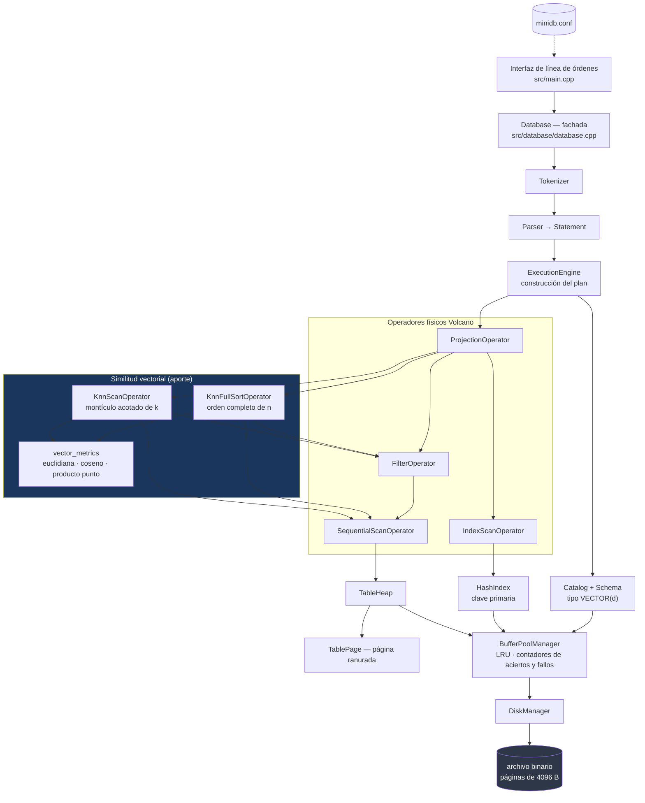

# Integración de búsqueda exacta por similitud vectorial en un Mini-SGBD paginado: selección Top-k acotada frente a ordenamiento completo

**Javier Alonzo Peñalva Humire**
**Lizzy Arlette Huayhua Perez**
**Emilio Alejandro Condori Pallardel**

Escuela Profesional de Ciencia de la Computación
Universidad Nacional de San Agustín de Arequipa
Arequipa, Perú

`jpenalvah@unsa.edu.pe`
`lhuayhuape@unsa.edu.pe`
`econdoripal@unsa.edu.pe`

Curso: Base de Datos II — Docente: [COMPLETAR NOMBRE DEL DOCENTE]

---

## Resumen

Los sistemas gestores de bases de datos relacionales recuperan registros mediante
predicados de igualdad y orden sobre valores escalares, un modelo que no expresa la
noción de proximidad que requieren las representaciones vectoriales densas. Este
trabajo incorpora búsqueda por similitud vectorial a un Sistema Gestor de Base de Datos
(SGBD) didáctico escrito en C++20, con almacenamiento paginado, administrador de buffer
con reemplazo LRU (*Least Recently Used*) y procesamiento de consultas según el modelo
Volcano. El aporte es un tipo de dato vectorial persistido en las mismas páginas
ranuradas que los registros convencionales, tres funciones de distancia y similitud, y
una consulta de los `k` vecinos más cercanos integrada en la gramática del sistema. Se
comparan dos estrategias de ranking, ambas exactas y exhaustivas: una selección Top-k
mediante montículo acotado y un ordenamiento completo de las `n` distancias, cuyos
costes son `O(n·d + n log k)` y `O(n·d + n log n)`. Sobre vectores sintéticos con
semilla fija, de 1000 a 100 000 vectores, dimensiones de 16 a 256 y `k` entre 1 y 50, se
midieron latencia, percentiles, distancias calculadas y métricas del buffer, con 30
consultas por configuración. La selección Top-k reduce la latencia entre 1,19 y 1,67
veces, con una ventaja que crece con el número de vectores y decrece con la
dimensionalidad, mientras el coste de entrada y salida resulta idéntico en ambas. La
limitación principal es que la búsqueda permanece exhaustiva: sin índice vectorial, el
coste sigue siendo lineal en el número de vectores almacenados.

---

## Palabras clave

Mini-SGBD; búsqueda por similitud vectorial; vecinos más cercanos; selección Top-k;
distancia euclidiana; similitud coseno; administración de buffer; modelo Volcano.

---

## 1. Introducción

Los sistemas gestores de bases de datos (SGBD) organizan la información en
estructuras que permiten recuperarla mediante predicados sobre valores escalares.
Los métodos de acceso clásicos —índices basados en árboles B+ y en tablas de
dispersión— están diseñados para responder preguntas de igualdad y de rango sobre
dominios totalmente ordenados. Esa correspondencia entre el predicado y la estructura
de acceso es la que permite que una consulta sobre millones de registros se resuelva
tocando unas pocas páginas.

El crecimiento de los datos no estructurados ha desplazado parte de la carga de
consulta hacia un tipo de pregunta que ese modelo no expresa. Textos, imágenes y
audio se representan hoy mediante vectores densos de decenas o cientos de
dimensiones, obtenidos de modelos de aprendizaje profundo, en los que la proximidad
geométrica aproxima la similitud semántica. La pregunta relevante deja de ser «qué
registros tienen exactamente este valor» y pasa a ser «qué registros se parecen más a
este». Un índice hash no puede responderla: dispersa las claves precisamente para
destruir la vecindad, de modo que dos vectores casi idénticos caen en cubetas sin
relación. Un árbol B+ tampoco, porque un vector de dimensión `d > 1` no admite un
orden total único que preserve la proximidad en todas las direcciones.

Esta brecha ha producido una generación de sistemas especializados y de extensiones a
sistemas existentes. El problema, sin embargo, no es solamente de estructura de
índice: incorporar vectores a un SGBD exige decidir cómo se representan en el formato
binario, cómo se validan, cómo se relacionan con los registros convencionales y cómo
se integra el operador de ranking en el motor de consultas existente. Esas decisiones
son las que este trabajo aborda.

**Problema abordado.** Un SGBD didáctico con almacenamiento paginado, administrador
de buffer y procesamiento de consultas por operadores físicos no puede expresar ni
resolver consultas de proximidad, porque su sistema de tipos no representa vectores y
su único método de acceso responde igualdades exactas.

**Objetivo.** Incorporar búsqueda exacta por similitud vectorial al sistema,
integrada con su gestor de almacenamiento, su administrador de buffer y su modelo de
ejecución, y evaluar cuantitativamente el efecto de la estrategia de ranking sobre el
coste de la consulta.

**Alcance.** El trabajo cubre la representación, la persistencia, las métricas, la
consulta de los `k` vecinos más cercanos y su evaluación experimental. **No** cubre la
construcción de un índice vectorial: la búsqueda implementada es exhaustiva, y el
artículo es explícito al respecto en cada punto donde podría confundirse. La búsqueda
aproximada y, con ella, la métrica `Recall@k`, quedan fuera por la misma razón.

**Aporte distintivo.** Dentro del contexto del proyecto, la contribución es la
integración de un tipo de dato vectorial y de una consulta de vecinos más cercanos en
un motor paginado preexistente, junto con la comparación medida de dos estrategias de
ranking sobre datos, consultas y configuración idénticos. No se reclama novedad
científica frente a la literatura de búsqueda vectorial: los algoritmos empleados son
conocidos, y lo que el trabajo aporta es su integración verificable y su evaluación
en un sistema cuyo comportamiento de entrada y salida es observable en detalle.

**Limitaciones principales.** El coste de una consulta crece linealmente con el número
de vectores almacenados; la mejora obtenida es un factor constante, no un cambio de
orden de complejidad; y los volúmenes evaluados están acotados por el formato de
página de 4 KiB del sistema.

### 1.1 Contribuciones verificables

1. Un tipo de dato `VECTOR(d)` con dimensión fija declarada en el esquema,
   serializado en formato IEEE 754 binario de 32 bits *little-endian* y persistido en
   las mismas páginas ranuradas que los demás registros
   (`src/storage/record.cpp`, funciones `Record::SerializeTo` y
   `Record::DeserializeFrom`).
2. La restauración de un invariante del diseño original que el tipo vectorial rompía:
   la garantía de que ningún registro válido puede exceder la capacidad de una página
   vacía (`src/catalog/schema.cpp`, constructor `Schema::Schema`).
3. Tres métricas —distancia euclidiana, similitud y distancia coseno, y producto
   punto— con tratamiento explícito del vector nulo y validación de dimensiones
   (`src/vector/distance.cpp`).
4. Dos operadores físicos que resuelven la misma consulta de vecinos más cercanos con
   costes de ranking distintos, y cuya equivalencia de resultados se verifica
   automáticamente (`src/execution/knn_operators.cpp`).
5. Instrumentación de distancias calculadas y de candidatos retenidos, integrada en el
   mismo mecanismo de contadores por operador que el resto del motor
   (`include/minidb/execution/physical_operator.hpp`).
6. Un arnés experimental reproducible con semilla fija, que exporta resultados crudos
   a CSV sin intervención manual (`experimentos/scripts/`).

### 1.2 Organización del artículo

La sección 2 sitúa el trabajo frente a la literatura de búsqueda por similitud. La
sección 3 describe la arquitectura del sistema y el punto de integración del aporte.
La sección 4 justifica las decisiones de diseño y sus costes teóricos. La sección 5
detalla la implementación con referencias al código. La sección 6 presenta el diseño
experimental y los resultados. La sección 7 los interpreta y discute sus amenazas a
la validez. La sección 8 concluye y propone trabajo futuro.

---

## 2. Trabajos relacionados

### 2.1 El problema de los vecinos más cercanos y el efecto de la dimensionalidad

Dado un conjunto de vectores `V = {v₁, …, vₙ}` con `vᵢ ∈ ℝᵈ` y una consulta
`q ∈ ℝᵈ`, la búsqueda de los `k` vecinos más cercanos consiste en obtener el
subconjunto de tamaño `k` que minimiza una función de distancia `d(q, vᵢ)`, o que
maximiza una función de similitud `s(q, vᵢ)`.

La solución exacta por excelencia es el recorrido exhaustivo: calcular las `n`
distancias y seleccionar las `k` menores, con coste `Θ(n·d)` en aritmética. Las
estructuras de indexación espacial clásicas —árboles k-d [1] y árboles R [2]— reducen
ese coste particionando el espacio, y funcionan bien en dimensiones bajas.

El resultado que gobierna este campo es que dejan de funcionar al crecer `d`. Weber,
Schek y Blott [3] mostraron cuantitativamente que, por encima de unas pocas decenas
de dimensiones, cualquier método de partición del espacio termina examinando una
fracción tan grande del conjunto que resulta más lento que un recorrido secuencial
bien implementado, porque el recorrido lee memoria de forma contigua y el índice no.
Beyer y colaboradores [4] complementaron ese análisis mostrando que, bajo condiciones
amplias, al crecer la dimensión la distancia al vecino más cercano y la distancia al
más lejano convergen, de modo que la noción misma de «vecino más cercano» pierde
contraste.

Esta es la razón por la que el recorrido exhaustivo sigue siendo una línea base
respetable en la literatura y no un método ingenuo, y por la que el presente trabajo
puede evaluar seriamente dos variantes de ranking exhaustivo. Es también la razón por
la que el campo se desplazó hacia la búsqueda aproximada.

### 2.2 Búsqueda aproximada

La búsqueda aproximada renuncia a garantizar el resultado exacto para obtener una
reducción de latencia de órdenes de magnitud, y se evalúa mediante `Recall@k`, la
fracción de los `k` vecinos verdaderos que recupera.

El *hashing* sensible a la localidad (LSH) fue introducido por Indyk y Motwani [5] y
desarrollado para búsqueda en dimensiones altas por Gionis, Indyk y Motwani [6]. Su
idea es construir familias de funciones que colisionen con probabilidad creciente en
la proximidad: exactamente lo contrario de la función hash que emplea un índice de
igualdad. Su ventaja es la garantía probabilística demostrable; su limitación, que
alcanzar un `recall` alto exige muchas tablas y por tanto mucha memoria.

La cuantización de producto (PQ), de Jégou, Douze y Schmid [7], descompone el espacio
en subespacios y cuantiza cada uno por separado, comprimiendo cada vector a unos
pocos bytes y permitiendo calcular distancias aproximadas mediante tablas
precalculadas. Su ventaja es la compresión; su limitación, la pérdida de precisión
inherente a la cuantización.

Los grafos de proximidad jerárquicos (HNSW), de Malkov y Yashunin [8], construyen un
grafo navegable multinivel y buscan por descenso codicioso. Constituyen hoy el punto
de referencia práctico en tiempo de consulta, con la contrapartida de un coste de
construcción y un consumo de memoria elevados, y de una estructura difícil de
mantener bajo actualizaciones. Los índices de archivo invertido (IVF), popularizados
por la biblioteca FAISS [9], [10], agrupan los vectores en celdas mediante k-means y
exploran solo las más cercanas a la consulta, ofreciendo un compromiso ajustable
mediante el número de celdas exploradas.

La diferencia de todos ellos respecto de este trabajo es directa: ninguno está
implementado aquí. Se describen porque delimitan lo que el sistema **no** hace y
porque son la línea de trabajo futuro más natural, en particular IVF, cuyo patrón de
celdas persistidas en páginas encaja con la arquitectura descrita en la sección 3.

### 2.3 Bases de datos vectoriales y extensiones a SGBD existentes

Milvus [11] representa la aproximación de sistema especializado: una arquitectura
diseñada alrededor del índice vectorial, con almacenamiento y planificación propios.
Su ventaja es el rendimiento a gran escala; su limitación, que la integración con
datos relacionales queda fuera del sistema.

La aproximación complementaria consiste en extender un SGBD relacional. La extensión
`pgvector` [12] añade a PostgreSQL un tipo de dato vectorial, operadores de distancia
e índices IVF-Flat y HNSW, reutilizando el gestor de almacenamiento, el registro de
escritura anticipada y el planificador del sistema anfitrión. Sistemas como Qdrant
[13] ocupan una posición intermedia, con filtrado por metadatos integrado en el
recorrido del índice.

El presente trabajo sigue conceptualmente la segunda aproximación —extender un motor
existente en lugar de construir uno especializado— pero en una escala didáctica y sin
índice vectorial. La comparación pertinente no es de rendimiento, que sería absurda,
sino de decisiones de integración: qué se necesita tocar en el sistema de tipos, en el
formato binario, en el catálogo y en el motor de consultas para que una consulta de
proximidad conviva con las consultas relacionales.

### 2.4 Procesamiento de consultas y administración de buffer

El motor sobre el que se construye el aporte sigue el modelo Volcano de Graefe [14],
[15], en el que cada operador físico es un iterador con las operaciones `Open`, `Next`
y `Close`, y un plan es un árbol que transmite tuplas hacia arriba. Los operadores
introducidos en este trabajo son operadores Volcano bloqueantes: no pueden emitir su
primera fila antes de haber examinado la última de su entrada, igual que un
ordenamiento.

La ejecución por lotes, o vectorizada en el sentido de MonetDB/X100 [16], amortiza el
coste de interpretación del plan procesando bloques de tuplas. Conviene subrayar que
ese sentido del término *vectorización* —procesamiento por lotes de registros— es
distinto del que da título a este artículo, que se refiere a la similitud entre
vectores numéricos como dato. El sistema evaluado implementa ambos, y la sección 6
documenta que el ranking de vecinos puede alimentarse desde el escaneo por lotes sin
que el resultado cambie.

La gestión del buffer sigue los principios sistematizados por Effelsberg y Haerder
[17], y los conceptos de página, marco y política de reemplazo se emplean con el
significado que les dan los textos de referencia del área [18], [19].

---

## 3. Arquitectura propuesta

El sistema es un SGBD monoproceso y monohilo que persiste toda la base de datos en un
único archivo binario dividido en páginas de 4096 bytes. La figura 1 muestra sus
capas y el punto de integración del aporte.

**Figura 1.** Arquitectura del sistema. Los componentes en el subgrafo de similitud
vectorial son los introducidos por este trabajo.



### 3.1 Componentes y punto de integración

| Componente | Responsabilidad | Archivo |
|---|---|---|
| Interfaz | Lectura de sentencias, presentación de resultados, órdenes internas de medición | `src/main.cpp` |
| Procesador de comandos | Texto SQL a estructuras de datos puras | `src/parser/tokenizer.cpp`, `src/parser/parser.cpp` |
| Catálogo | Esquema y punteros raíz, persistidos en la página 1 | `src/catalog/catalog.cpp` |
| Gestor de tablas | Cadena de páginas ranuradas, operaciones por identificador de registro | `src/storage/table_heap.cpp` |
| Administrador de páginas | Vista ranurada sobre 4096 bytes; directorio de ranuras y compactación | `src/storage/table_page.cpp` |
| Administrador de buffer | Marcos en RAM, tabla de páginas, reemplazo LRU, contadores | `src/buffer/buffer_pool_manager.cpp` |
| Gestor de almacenamiento | Lectura y escritura de páginas completas, asignación de identificadores | `src/storage/disk_manager.cpp` |
| **Tipo vectorial** | `VECTOR(d)` como tercer tipo de columna | `include/minidb/common/types.hpp`, `include/minidb/common/value.hpp` |
| **Módulo de métricas** | Distancias y similitudes entre vectores | `src/vector/distance.cpp` |
| **Ejecutor k-NN** | Ranking exacto con selección Top-k | `src/execution/knn_operators.cpp` |
| **Línea base de ranking** | Ranking exacto con orden completo | ídem, clase `KnnFullSortOperator` |
| Instrumentación | Contadores por operador y por sentencia | `include/minidb/execution/physical_operator.hpp` |

Índice vectorial: no implementado. El único índice del sistema es una tabla de
dispersión sobre la clave primaria (`src/index/hash_index.cpp`), que resuelve
igualdades exactas y no participa en la búsqueda por similitud.

La integración es deliberadamente conservadora. Los vectores no viven en un
almacenamiento aparte: son valores de columna dentro de los mismos registros
ranurados, leídos y escritos a través del mismo administrador de buffer que todo lo
demás. En consecuencia, una consulta de proximidad se beneficia de la administración
de memoria existente y sus accesos aparecen en los mismos contadores de aciertos y
fallos, lo que hace su coste de entrada y salida directamente observable.

---

## 4. Diseño del sistema

### 4.1 Representación de los vectores

Un valor vectorial es un arreglo de `float` de 32 bits de longitud fija. La
dimensión se declara en el esquema y se almacena en el mismo campo de 16 bits que ya
guardaba la longitud máxima de una columna `VARCHAR`, lo que evita modificar la
disposición de la página de catálogo.

La elección de `float` en lugar de `double` reduce a la mitad los bytes por vector.
La precisión de un ranking de similitud está limitada por el propio modelo que produjo
el vector mucho antes que por los 24 bits de mantisa de un `float`, y los sistemas de
referencia del área utilizan 32 bits por la misma razón.

**Formato en disco.** Una dimensión de 16 bits seguida de `d` valores de 32 bits en
orden *little-endian*: `2 + 4d` bytes. Los bits del `float` se obtienen con
`std::bit_cast`, no reinterpretando un puntero, de modo que el formato queda definido
por el estándar y no por la disposición que el compilador dé a un `float`.

La dimensión se escribe aunque el esquema ya la fije. Es redundancia deliberada: un
registro puede leerse sin consultar el catálogo, y una longitud corrupta se detecta al
deserializar en lugar de producir un vector silenciosamente desplazado.

**Validaciones.** La dimensión declarada debe estar entre 1 y 1000; un valor
insertado debe tener exactamente la dimensión declarada; una columna vectorial no
puede ser clave primaria, porque el índice hash mapea claves de 32 bits; y una columna
vectorial no admite comparación de orden ni agrupamiento, porque un vector no posee un
orden total natural único.

**Capacidad de página.** Con solo `INT` y `VARCHAR`, las cotas del sistema demostraban
que el registro más ancho posible ocupaba `8 × (2 + 255) = 2056` bytes, holgadamente
por debajo de los 4080 disponibles en una página vacía. Un vector rompe esa garantía:
dos columnas `VECTOR(1000)` requerirían 8004 bytes. El diseño restaura el invariante
comprobando en el constructor del esquema que el registro más ancho posible no exceda
la capacidad de la página. La alternativa —descubrirlo al insertar— produciría una
tabla en la que ciertas filas no caben en ninguna página.

### 4.2 Métricas

Sea `x, y ∈ ℝᵈ`. Las tres métricas implementadas son:

**Distancia euclidiana.**

```
d_euclidiana(x, y) = √( Σᵢ (xᵢ − yᵢ)² )
```

Interpreta la disimilitud como separación geométrica y es sensible a la magnitud de
los vectores. Coste `Θ(d)` en tiempo y `O(1)` en espacio adicional. Orden ascendente:
menor es más similar.

**Similitud coseno.**

```
s_cos(x, y) = (x · y) / (‖x‖ ‖y‖)
```

Mide el ángulo entre los vectores e ignora sus magnitudes, lo que la hace la métrica
habitual para representaciones cuya norma no es informativa. Recorrido `[−1, 1]`,
orden descendente. Coste `Θ(d)`.

**Distancia coseno.**

```
d_cos(x, y) = 1 − s_cos(x, y)
```

Recorrido `[0, 2]`, orden ascendente. Es una cantidad distinta de la similitud, y
confundirlas invierte el ranking; el diseño las mantiene como funciones separadas y la
distinción se verifica en las pruebas.

**Producto punto.**

```
s_dot(x, y) = Σᵢ xᵢ yᵢ
```

Orden descendente. Coincide con la similitud coseno cuando ambos vectores están
normalizados; el sistema no normaliza automáticamente, de modo que la equivalencia es
responsabilidad de quien carga los datos.

**Vector nulo.** El coseno no está definido cuando alguna norma es cero, porque el
vector nulo no tiene dirección. La implementación define la similitud como 0 en ese
caso y lo documenta, en lugar de devolver un `NaN` que haría que el resultado del
ranking dependiera del orden en que se visitaron los registros.

**Puntuación de ranking.** Para que un único operador implemente las tres métricas con
una sola comparación, el diseño introduce una puntuación en la que **menor es siempre
más cercano**: la distancia euclidiana **al cuadrado**, la distancia coseno, y el
producto punto **negado**. La raíz cuadrada se aplica únicamente a los `k` valores que
se reportan, no a los `n` que se comparan: es una función monótona creciente, de modo
que no altera el orden, y omitirla ahorra `n − k` llamadas a `sqrt` por consulta.

### 4.3 Algoritmo de los `k` vecinos más cercanos

Ambas estrategias son exactas y examinan todos los registros. Difieren en el ranking.

**Selección Top-k acotada.** Mantiene un montículo de máximos de tamaño `k`, cuya raíz
es el peor de los supervivientes. Un candidato solo entra si mejora esa raíz.

```
Abrir():
    si k = 0: cerrar hijo y terminar          # respuesta vacía sin leer la tabla
    mientras el hijo produzca un registro:
        puntuación ← RankingScore(métrica, vector del registro, consulta)
        contar una distancia
        si |montículo| < k:
            insertar candidato
        si no, si candidato mejor que la raíz del montículo:
            extraer la raíz e insertar el candidato
    cerrar el hijo
    ordenar el montículo de forma ascendente

Siguiente():
    devolver el siguiente elemento del resultado, añadiendo la columna de distancia
```

Coste: `Θ(n·d)` de aritmética, `O(n log k)` de operaciones de montículo, `O(k)` de
espacio.

**Ordenamiento completo (línea base).** Puntúa cada registro, **conserva todos**,
ordena las `n` puntuaciones y descarta todo salvo las `k` primeras. Coste `Θ(n·d)` de
aritmética, `O(n log n)` de ordenamiento, `O(n)` de espacio. Con una tabla grande el
coste espacial es el más dañino de los dos, porque cada candidato arrastra un registro
completo con su vector.

**Desempates.** Dos registros a la misma distancia se ordenan por clave primaria. Sin
esa regla el resultado dependería del orden en que el montículo hubiera desalojado
candidatos, que a su vez depende de la disposición física de las páginas: la consulta
dejaría de ser reproducible.

**Casos límite.** `k = 0` produce una respuesta vacía sin recorrer la tabla; `k > n`
devuelve los `n` registros; una tabla vacía devuelve cero filas y cero distancias
calculadas; una dimensión incompatible entre la consulta y la columna se rechaza al
construir el plan, antes de leer una sola página.

### 4.4 Integración con el motor

El plan de una consulta de proximidad es
`Projection( Knn( Filter? ( Scan ) ) )`. Dos consecuencias se siguen de esa forma:

1. **Búsqueda híbrida.** Una cláusula `WHERE` situada debajo del ranking reduce el
   conjunto de candidatos antes de que se calcule una sola distancia. La sección 6
   documenta que con un filtro que deja pasar 50 de 400 registros se calculan
   exactamente 50 distancias.
2. **Independencia del método de acceso.** El ranking consume de un operador de
   escaneo cualquiera, de modo que el escaneo tupla a tupla y el escaneo por lotes
   pueden alimentarlo indistintamente sin que el resultado cambie.

La columna de distancia se añade a la salida con el nombre `distancia`, y la
proyección puede descartarla como cualquier otra columna.

### 4.5 Compromisos de diseño

| Decisión | Alternativa descartada | Motivo |
|---|---|---|
| Vectores dentro del registro | Almacenamiento vectorial separado | Reutiliza páginas, buffer y catálogo; los accesos aparecen en los contadores existentes |
| `float` de 32 bits | `double` de 64 bits | Mitad de bytes por vector; la precisión del modelo limita antes |
| Dimensión fija por esquema | Dimensión libre por fila | Una distancia solo está definida entre vectores de igual dimensión |
| Distancia euclidiana al cuadrado para ordenar | Distancia con raíz | La raíz es monótona: `n − k` llamadas a `sqrt` evitadas por consulta |
| Desempate por clave primaria | Orden de visita | Reproducibilidad del resultado |
| Sin índice vectorial | IVF, HNSW | Fuera del alcance declarado; se propone como trabajo futuro |

---

## 5. Implementación

**Lenguaje y compilación.** C++20 sin extensiones, compilado con GCC 16.1.1 mediante
CMake 4.4.1 y Ninja 1.13.2. La única dependencia externa es GoogleTest 1.17 como
paquete del sistema. El proyecto suma 7735 líneas de cabeceras y fuentes y 5304 de
pruebas.

Los avisos del compilador activos incluyen `-Wall -Wextra -Wpedantic -Wshadow
-Wconversion -Wsign-conversion -Wnull-dereference`; la compilación en modo `Release`
no produce ninguno.

**Tipo vectorial.** El valor de una columna se representa como una variante que
incorpora el arreglo de `float`:

```cpp
using Vector = std::vector<float>;
using Value = std::variant<std::int32_t, std::string, Vector, float>;
```

La cuarta alternativa, `float` escalar, nunca se persiste: ningún tipo de columna se
corresponde con ella. Existe para que la distancia calculada viaje por el plan como
cualquier otro valor, y `Record::Validate` la rechaza, que es lo que la mantiene fuera
del archivo.

Fuente: `include/minidb/common/value.hpp`

**Serialización.** Los bits del `float` se obtienen sin reinterpretar punteros:

```cpp
void WriteF32(std::span<std::byte> buffer, std::size_t offset, float value) {
    static_assert(sizeof(float) == sizeof(std::uint32_t),
                  "el formato del archivo asume IEEE 754 binary32");
    WriteLittleEndian(buffer, offset, std::bit_cast<std::uint32_t>(value), sizeof(value));
}
```

Fuente: `src/common/serialization.cpp`, función `serialization::WriteF32`

**Métrica.** La puntuación de ranking unifica el sentido del orden de las tres
métricas:

```cpp
float RankingScore(DistanceMetric metric, const Vector& left, const Vector& right) {
    switch (metric) {
        case DistanceMetric::kEuclidean:
            return SquaredEuclideanDistance(left, right);
        case DistanceMetric::kCosine:
            return CosineDistance(left, right);
        case DistanceMetric::kDotProduct:
            return -DotProduct(left, right);
    }
    throw StorageError("Métrica de distancia desconocida");
}
```

Fuente: `src/vector/distance.cpp`, función `vector_metrics::RankingScore`

Las sumas se acumulan en `double` y se devuelven como `float`: con 1000 dimensiones un
acumulador de 32 bits pierde precisión por redondeo, y el coste adicional es
despreciable frente al tráfico de memoria de leer los vectores.

**Selector Top-k.** El núcleo del operador propuesto es la comparación contra la raíz
del montículo:

```cpp
if (results_.size() < clause_.k) {
    CountCandidate();
    results_.push_back(std::move(candidate));
    std::push_heap(results_.begin(), results_.end(), farther);
    continue;
}
if (Closer(candidate, results_.front())) {
    CountCandidate();
    std::pop_heap(results_.begin(), results_.end(), farther);
    results_.back() = std::move(candidate);
    std::push_heap(results_.begin(), results_.end(), farther);
}
```

Fuente: `src/execution/knn_operators.cpp`, función `KnnScanOperator::Open`

**Línea base.** El ordenamiento completo comparte el cálculo de puntuación y difiere
solo en que conserva todos los candidatos y ordena `n` elementos:

```cpp
while (auto record = child_->Next()) {
    results_.push_back(Score(std::move(*record)));
    CountCandidate();
}
child_->Close();
std::sort(results_.begin(), results_.end(), Closer);
if (results_.size() > clause_.k) {
    results_.resize(clause_.k);
}
```

Fuente: `src/execution/knn_operators.cpp`, función `KnnFullSortOperator::Open`

Que ambas estrategias compartan la función `Score` no es un detalle de estilo: es lo
que garantiza que la aritmética medida sea idéntica y que la diferencia observada
proceda exclusivamente del ranking.

**Contadores.** La instrumentación se incrementa en el punto exacto donde ocurre el
trabajo, de modo que no puede desviarse de él:

```cpp
void CountDistance() { ++distance_calculations_; }
void CountCandidate() { ++candidates_admitted_; }
```

Fuente: `include/minidb/execution/physical_operator.hpp`, clase `PhysicalOperator`

**Contadores de buffer.** Los que ya existían distinguen las tres nociones que el
diseño experimental requiere: un acceso lógico se contabiliza como acierto o fallo en
`BufferPoolManager::FetchPage`, mientras que `disk_reads` se incrementa únicamente
cuando se invoca `DiskManager::ReadPage`, es decir cuando hay lectura física.

Fuente: `src/buffer/buffer_pool_manager.cpp`, función `BufferPoolManager::FetchPage`

**Interfaz de consulta.** La gramática admitida es:

```sql
SELECT { * | <col> | COUNT(*) }, ... FROM <tabla>
    [WHERE <col> <op> <valor>]
    NEAREST <col_vector> TO [<v₁>, <v₂>, ...]
    [USING EUCLIDEAN | COSINE | DOT]
    LIMIT <k>;
```

`LIMIT` es obligatorio en una consulta de proximidad porque es lo que aporta `k`; una
búsqueda por similitud sin cota ordenaría la tabla entera, que nunca es la intención.
Fuera de esa cláusula, `LIMIT` se rechaza, para no sugerir un operador de límite
general que el sistema no implementa.

**Pruebas automatizadas.** 316 casos en 13 binarios, todos en verde en modo `Release`
y bajo AddressSanitizer y UndefinedBehaviorSanitizer. Los relativos al aporte son
`tests/distance_test.cpp`, con 19 casos que verifican las métricas contra valores de
forma cerrada, y `tests/knn_test.cpp`, con 33 casos que cubren la persistencia del
tipo, los casos límite, la gramática y la equivalencia entre las dos estrategias.

---

## 6. Experimentos y resultados

### 6.1 Preguntas de investigación

- **PI1.** ¿Cómo afecta el número de vectores almacenados al tiempo de ejecución de
  una consulta de similitud?
- **PI2.** ¿Cómo influye la dimensionalidad en el coste de una consulta de los `k`
  vecinos más cercanos?
- **PI3.** ¿Qué diferencia de rendimiento existe entre la selección Top-k acotada y el
  ordenamiento completo, y cómo varía esa diferencia con `n`, `d` y `k`?
- **PI4.** ¿Cómo se comportan las lecturas físicas de página y la tasa de aciertos del
  buffer durante las consultas vectoriales, y difieren entre ambas estrategias?

### 6.2 Hipótesis

- **H1.** La latencia crecerá aproximadamente de forma lineal con `n`, al ser la
  búsqueda exhaustiva y dominar el término `Θ(n·d)`.
- **H2.** La latencia crecerá con `d`, pero de forma sublineal, porque existe un coste
  por registro independiente de la dimensión: localizar la ranura y deserializar el
  resto de la fila.
- **H3.** La selección Top-k será más rápida que el ordenamiento completo, y su ventaja
  relativa **crecerá con `n`** —porque `log n` crece y `log k` no— y **decrecerá con
  `d`**, porque el término aritmético común pasa a dominar.
- **H4.** El comportamiento de entrada y salida será idéntico en ambas estrategias, al
  realizar el mismo recorrido; la ventaja del Top-k será exclusivamente de cómputo.
- **H5.** El efecto de `k` sobre la latencia será pequeño frente al de `n` y `d`, al
  intervenir únicamente a través de un `log k`.

### 6.3 Entorno experimental

| Elemento | Valor |
|---|---|
| Compilador | GCC 16.1.1 |
| Estándar | C++20, sin extensiones |
| Compilación | `Release` (`-O3 -DNDEBUG`) |
| Sistema de construcción | CMake 4.4.1 con Ninja 1.13.2 |
| Sistema operativo | Linux 7.1.5 (CachyOS) |
| Hardware | [COMPLETAR DATOS DEL HARDWARE] |
| Fecha de ejecución | [COMPLETAR FECHA DE EJECUCIÓN] |
| Marcos del Buffer Pool | 8 (32 KiB de datos residentes) |
| Tamaño de página | 4096 bytes |

Ambas estrategias se ejecutan en el mismo proceso, sobre el mismo archivo, con la
misma configuración de buffer y las mismas consultas. Lo único que difiere entre
rondas es el operador de ranking que el planificador construye.

### 6.4 Conjunto de datos

Vectores sintéticos con componentes independientes y uniformes en `[0, 1)`, generados
con `numpy.random.default_rng(42)`. Los datos **no** representan textos ni imágenes
reales, y ninguna conclusión depende de que lo hicieran: lo que se mide es el coste de
recorrer y ordenar `n` vectores de dimensión `d`, que es independiente de su
significado. Esa independencia es a la vez una limitación, discutida en la sección 7.7.

Los vectores de consulta se generan **dentro del binario** con `std::mt19937` y
semilla 42, no desde los guiones: así ambas estrategias reciben consultas idénticas
byte a byte y la reproducibilidad no depende de la cadena de herramientas externa.

**Tabla 1.** Coste de carga y tamaño en disco del conjunto de datos.

| Vectores | Dimensión | Tiempo de carga (s) | Archivo (bytes) | Páginas |
|---:|---:|---:|---:|---:|
| 1 000 | 64 | 0,038 | 352 256 | 86 |
| 10 000 | 16 | 0,258 | 962 560 | 235 |
| 10 000 | 32 | 0,405 | 1 609 728 | 393 |
| 10 000 | 64 | 0,937 | 3 051 520 | 745 |
| 10 000 | 128 | 2,949 | 5 996 544 | 1 464 |
| 10 000 | 256 | 14,301 | 13 799 424 | 3 369 |
| 50 000 | 64 | 19,093 | 15 147 008 | 3 698 |
| 100 000 | 64 | 78,945 | 30 302 208 | 7 398 |

La tabla 1 documenta un comportamiento que no era el objeto del estudio pero que
merece registrarse: el tiempo de carga crece de forma marcadamente superlineal, 84
veces al pasar de 10 000 a 100 000 vectores. La sección 7.2 lo explica.

### 6.5 Configuraciones evaluadas

Se varía un factor a la vez alrededor de una configuración central de `n = 10 000`,
`d = 64`, `k = 10`:

- **Número de vectores:** 1 000, 10 000, 50 000, 100 000.
- **Dimensión:** 16, 32, 64, 128, 256.
- **Vecinos solicitados:** 1, 5, 10, 20, 50.

Doce configuraciones, dos estrategias, una consulta de calentamiento descartada y 30
consultas medidas por estrategia: 720 observaciones crudas.

Los volúmenes se acotaron a lo que el formato de página admite con holgura. Con
`d = 768`, la dimensión de los modelos de lenguaje habituales, un vector ocuparía 3074
bytes y cabría **uno por página**, de modo que el escaneo degeneraría en una lectura
de página por registro y el experimento mediría el subsistema de archivos más que la
búsqueda. La sección 7.7 lo discute como amenaza a la validez externa.

### 6.6 Validación funcional

Antes de medir se verificó la corrección sobre casos de resultado calculable a mano.
Con `A = [1, 0]`, `B = [0, 1]`, `C = [1, 1]` y consulta `q = [0,9, 0,1]`, las
distancias euclidianas son `√0,02 ≈ 0,1414`, `√0,82 ≈ 0,9055` y `√1,62 ≈ 1,2728`, de
donde el orden esperado es `A`, `C`, `B`. El sistema lo reproduce, y con la métrica de
producto punto el orden pasa a `C`, `A`, `B`, como corresponde a una similitud y no a
una distancia.

Se validaron además: vectores duplicados y empates, resueltos por clave primaria;
vector idéntico a uno almacenado, a distancia cero; componentes negativas; vector
nulo, tanto almacenado como de consulta; tabla vacía; dimensiones incompatibles;
`k = 0`; y `k` mayor que el número de registros. Estos casos residen en
`tests/knn_test.cpp` y se ejecutan de forma independiente de los *benchmarks*.

**Tabla 2.** Exactitud: coincidencia entre las dos estrategias en las doce
configuraciones.

| Configuraciones comparadas | Filas devueltas iguales | Distancias calculadas iguales | Coinciden |
|---:|---:|---:|:--:|
| 12 de 12 | sí | sí | **sí** |

La tabla 2 resume la comprobación agregada: en las doce configuraciones ambas
estrategias devolvieron el mismo número de filas y calcularon el mismo número de
distancias. La igualdad de los vecinos concretos, registro a registro y en el mismo
orden, se verifica en las pruebas automatizadas, donde puede compararse el contenido
completo de cada fila. Al ser ambas búsquedas exactas, no procede calcular `Recall@k`:
esa métrica cuantifica la pérdida de una búsqueda aproximada, y aquí no hay ninguna.

### 6.7 Comparación de rendimiento

**Tabla 3.** Latencia frente al número de vectores (`d = 64`, `k = 10`, 30 consultas
por celda).

| Estrategia | Vectores | Media (ms) | Mín. (ms) | Máx. (ms) | σ (ms) | p50 | p95 | p99 | Cons./s | Distancias |
|---|---:|---:|---:|---:|---:|---:|---:|---:|---:|---:|
| Top-k | 1 000 | 0,591 | 0,583 | 0,608 | 0,005 | 0,590 | 0,600 | 0,608 | 1 693 | 1 000 |
| Orden completo | 1 000 | 0,777 | 0,750 | 0,955 | 0,047 | 0,765 | 0,943 | 0,955 | 1 287 | 1 000 |
| Top-k | 10 000 | 5,878 | 5,809 | 6,249 | 0,089 | 5,848 | 6,014 | 6,249 | 170 | 10 000 |
| Orden completo | 10 000 | 7,982 | 7,834 | 8,741 | 0,160 | 7,931 | 8,141 | 8,741 | 125 | 10 000 |
| Top-k | 50 000 | 30,354 | 29,980 | 30,730 | 0,184 | 30,370 | 30,636 | 30,730 | 33 | 50 000 |
| Orden completo | 50 000 | 45,294 | 43,245 | 52,624 | 2,025 | 44,667 | 49,961 | 52,624 | 22 | 50 000 |
| Top-k | 100 000 | 63,013 | 62,300 | 64,414 | 0,426 | 63,064 | 63,557 | 64,414 | 16 | 100 000 |
| Orden completo | 100 000 | 101,756 | 98,939 | 106,985 | 1,786 | 101,848 | 104,543 | 106,985 | 10 | 100 000 |

La figura 2 representa esos valores. Ambas curvas son rectas: la latencia por consulta
crece de forma lineal con `n`, tal como predice H1. La razón entre pendientes crece de
forma visible, y la figura 3 confirma en escala logarítmica que ambas series tienen
pendiente próxima a la unidad, es decir crecimiento lineal y no cuadrático.

**Figura 2.** `experimentos/graficos/latencia_vs_vectores.png` — latencia media frente
al número de vectores.

**Figura 3.** `experimentos/graficos/latencia_vs_vectores_log.png` — la misma relación
en escala doblemente logarítmica.

**Tabla 4.** Aceleración de la selección Top-k, por número de vectores y por
dimensión.

| Vectores (`d = 64`, `k = 10`) | Aceleración | | Dimensión (`n = 10 000`, `k = 10`) | Aceleración |
|---:|---:|---|---:|---:|
| 1 000 | 1,32× | | 16 | 1,67× |
| 10 000 | 1,36× | | 32 | 1,56× |
| 50 000 | 1,49× | | 128 | 1,22× |
| 100 000 | 1,61× | | 256 | 1,19× |

La tabla 4 muestra las dos tendencias opuestas que anticipaba H3: la ventaja del
Top-k **crece** con el número de vectores y **decrece** con la dimensión.

**Tabla 5.** Latencia frente a la dimensionalidad (`n = 10 000`, `k = 10`).

| Estrategia | Dimensión | Media (ms) | p50 | p95 | p99 | Cons./s |
|---|---:|---:|---:|---:|---:|---:|
| Top-k | 16 | 2,955 | 2,952 | 2,987 | 3,021 | 338 |
| Orden completo | 16 | 4,923 | 4,914 | 5,083 | 5,116 | 203 |
| Top-k | 32 | 3,694 | 3,683 | 3,789 | 3,834 | 271 |
| Orden completo | 32 | 5,758 | 5,754 | 5,901 | 5,913 | 174 |
| Top-k | 64 | 5,878 | 5,848 | 6,014 | 6,249 | 170 |
| Orden completo | 64 | 7,982 | 7,931 | 8,141 | 8,741 | 125 |
| Top-k | 128 | 10,378 | 10,320 | 10,763 | 10,769 | 96 |
| Orden completo | 128 | 12,656 | 12,615 | 13,187 | 13,244 | 79 |
| Top-k | 256 | 21,077 | 21,072 | 21,578 | 21,696 | 47 |
| Orden completo | 256 | 25,082 | 25,031 | 26,162 | 26,350 | 40 |

La figura 4 representa la tabla 5. Multiplicar la dimensión por 16 —de 16 a 256—
multiplica la latencia del Top-k por 7,1 y no por 16: el crecimiento es sublineal,
como anticipaba H2.

**Figura 4.** `experimentos/graficos/latencia_vs_dimension.png` — latencia frente a la
dimensión.

**Tabla 6.** Latencia frente a `k` (`n = 10 000`, `d = 64`).

| `k` | Top-k (ms) | σ | Orden completo (ms) | σ |
|---:|---:|---:|---:|---:|
| 1 | 6,098 | 0,095 | 8,388 | 0,085 |
| 5 | 5,915 | 0,095 | 8,267 | 0,523 |
| 10 | 5,878 | 0,089 | 7,982 | 0,160 |
| 20 | 6,100 | 0,110 | 8,753 | 0,877 |
| 50 | 5,966 | 0,099 | 8,170 | 0,377 |

La tabla 6 y la figura 5 muestran que `k` no produce ninguna tendencia apreciable en
el rango evaluado: la variación entre `k = 1` y `k = 50` es del orden de la desviación
estándar de las propias medidas. H5 queda confirmada.

**Figura 5.** `experimentos/graficos/latencia_vs_k.png` — latencia frente a `k`.

**Figura 6.** `experimentos/graficos/distancias_vs_vectores.png` — distancias
calculadas por consulta frente a `n`. Las dos series se superponen exactamente sobre
la recta `y = n`, que es la comprobación gráfica de que ninguna de las dos estrategias
poda el espacio de búsqueda.

### 6.8 Accesos a disco y comportamiento del buffer

**Tabla 7.** Entrada y salida por consulta (`d = 64`, `k = 10`). Los valores son
idénticos en ambas estrategias, por lo que se presenta una sola fila por volumen.

| Vectores | Páginas de datos | Lecturas físicas | Aciertos | Fallos | Tasa de aciertos | Registros examinados |
|---:|---:|---:|---:|---:|---:|---:|
| 1 000 | 86 | 67 | 1 000 | 67 | 0,9372 | 1 000 |
| 10 000 | 745 | 710 | 10 000 | 710 | 0,9337 | 10 000 |
| 50 000 | 3 698 | 3 567 | 50 000 | 3 567 | 0,9334 | 50 000 |
| 100 000 | 7 398 | 7 139 | 100 000 | 7 139 | 0,9334 | 100 000 |

La tabla 7 contiene tres observaciones. Primera, las lecturas físicas por consulta
equivalen prácticamente al número de páginas de datos: con ocho marcos de buffer, cada
consulta relee la tabla completa desde el disco. Segunda, los accesos lógicos
coinciden con el número de registros, porque el iterador del montículo de tabla fija y
libera la página en cada registro que devuelve. Tercera, la tasa de aciertos se
estabiliza en 0,933, valor que no refleja localidad aprovechada sino la relación entre
registros por página y páginas: aproximadamente `1 − 1/14` con 14 registros por página.

**Figura 7.** `experimentos/graficos/buffer_vs_vectores.png` — aciertos, fallos y
lecturas físicas por consulta frente a `n`.

**Figura 8.** `experimentos/graficos/tamano_vs_vectores.png` — tamaño del archivo de
datos frente a `n`.

### 6.9 Búsqueda híbrida y método de acceso

Dos propiedades adicionales se verifican en las pruebas automatizadas y no requieren
medición de tiempo, porque se comprueban con contadores deterministas.

Con una tabla de 400 vectores y la consulta
`SELECT * FROM docs WHERE id <= 50 NEAREST emb TO [...] LIMIT 5`, el plan construido
es `Projection → Knn → Filter → SequentialScan` y el número de distancias calculadas
es exactamente 50: el filtro por metadatos reduce el conjunto de candidatos antes de
que intervenga la aritmética vectorial.

Sustituir el escaneo tupla a tupla por el escaneo por lotes deja el resultado
intacto —mismas filas, mismo orden, mismo número de distancias— y cambia únicamente el
número de fijaciones de página. El ranking es, por tanto, independiente del método de
acceso que lo alimenta.

### 6.10 Análisis estadístico

Con 30 observaciones por celda, la dispersión de la selección Top-k es muy baja: su
desviación estándar relativa oscila entre el 0,6 % y el 1,5 % de la media, y sus
percentiles p95 y p99 se sitúan a menos del 3 % de la mediana. El ordenamiento
completo es sistemáticamente más disperso —hasta el 4,5 % de desviación relativa en
`n = 50 000`, con un p99 un 18 % por encima de su mediana—, lo que resulta coherente
con que asigne y libere memoria proporcional a `n` en cada consulta.

Las diferencias entre estrategias son de uno a dos órdenes de magnitud mayores que
esta dispersión: en `n = 100 000` la separación entre medias es de 38,7 ms frente a
desviaciones de 0,4 y 1,8 ms. Los intervalos no se solapan en ninguna configuración,
de modo que la diferencia observada no es atribuible al ruido de medición.

---

## 7. Discusión

### 7.1 Respuesta a las preguntas de investigación

**PI1.** El tiempo de consulta crece linealmente con el número de vectores. El
coeficiente medido para la selección Top-k con `d = 64` es de aproximadamente 0,63 ms
por cada mil vectores, sostenido en dos órdenes de magnitud de volumen. Es el
comportamiento esperado de una búsqueda exhaustiva y, más que un resultado, es la
confirmación de que el sistema hace lo que dice hacer: sin índice vectorial no existe
poda posible y todo registro debe examinarse.

**PI2.** La dimensionalidad encarece la consulta de forma sublineal. Ajustando un
modelo lineal a los datos de la tabla 5 para la selección Top-k se obtiene un
componente fijo de aproximadamente 1,75 ms por consulta, independiente de `d`, más
unos 0,0755 ms por dimensión. Ese componente fijo representa el 59 % del coste con
`d = 16` y solo el 8 % con `d = 256`: localizar la ranura, deserializar el resto de la
fila y atravesar el plan cuesta lo mismo con vectores cortos que con vectores largos,
y en dimensiones bajas ese trabajo domina sobre la aritmética vectorial.

**PI3.** La selección Top-k acotada es entre 1,19 y 1,67 veces más rápida que el
ordenamiento completo, con dos tendencias sistemáticas y opuestas. La ventaja crece
con `n` —de 1,32× con mil vectores a 1,61× con cien mil— y decrece con `d` —de 1,67×
con dimensión 16 a 1,19× con dimensión 256.

**PI4.** El comportamiento de entrada y salida es idéntico en ambas estrategias:
mismas lecturas físicas, mismos aciertos y fallos, misma tasa de aciertos, con
diferencia nula en las cuatro configuraciones de volumen. La ventaja del Top-k es
íntegramente de cómputo y de memoria, y no reduce en absoluto el tráfico con el disco.
Es la respuesta más importante del estudio en términos de honestidad: mejora la mitad
del coste que es aritmética, y no toca la mitad que es almacenamiento.

### 7.2 Interpretación del comportamiento observado

El resultado que mejor conecta la medición con la teoría es la evolución opuesta de la
aceleración frente a `n` y frente a `d`. Ambos comportamientos se siguen del mismo
modelo de coste. El tiempo de una consulta puede escribirse como
`T ≈ a·n·d + b·n·log R + c·n`, donde `R = k` para la selección acotada y `R = n` para
el ordenamiento completo, y `c·n` recoge el coste por registro independiente de la
dimensión.

Al aumentar `n` con `d` fijo, el término que distingue las estrategias crece como
`n log n` frente a `n log k`, mientras el resto crece linealmente: el peso relativo de
la diferencia aumenta, y la aceleración con ella. Al aumentar `d` con `n` fijo, el
término `a·n·d` crece y los demás no: la diferencia entre estrategias se diluye en un
coste aritmético común, y la aceleración disminuye. Las dos tendencias medidas son,
por tanto, manifestaciones de una sola relación, y su concordancia con el modelo es la
evidencia más sólida de que lo que se está midiendo es realmente el coste del ranking.

La independencia de `k` completa el cuadro. Entre `k = 1` y `k = 50`, `log₂ k` pasa de
0 a 5,6, mientras `log₂ n` vale 13,3 con diez mil vectores. La diferencia predicha por
el modelo queda por debajo de la dispersión de las medidas, y es exactamente lo que se
observa. Conviene subrayar la lectura práctica: el coste de una búsqueda exhaustiva lo
determina el tamaño de la colección, no cuántos vecinos se pidan.

La superlinealidad del tiempo de carga de la tabla 1 tiene un origen distinto y ajeno
al aporte. La inserción en el montículo de tabla intenta primero la última página y,
si no cabe, recorre la cadena buscando espacio liberado, comportamiento heredado del
diseño original y pensado para reutilizar huecos. Con `n` inserciones sobre una cadena
que crece hasta `p` páginas, el recorrido acumula del orden de `n·p/2` fijaciones de
página. Para `n = 100 000` y `p = 7 398` eso arroja unos 3,7 × 10⁸ accesos al buffer,
que a un coste de doscientos nanosegundos por acierto explica los 79 segundos medidos.
Es una limitación real del sistema, no una consecuencia de los vectores, aunque los
vectores la hacen visible al reducir los registros por página.

### 7.3 Razones técnicas de las diferencias

La selección acotada gana por tres mecanismos, en orden de importancia decreciente.
Primero, ordena `k` elementos en lugar de `n`: con cien mil vectores y `k = 10`, unas
33 comparaciones de montículo frente a las aproximadamente 1,7 millones que exige un
`std::sort` de cien mil elementos. Segundo, la mayoría de los candidatos se descartan
con una única comparación contra la raíz del montículo, sin entrar en la estructura;
las pruebas documentan un caso en el que solo diez de trescientos candidatos son
admitidos. Tercero, mantiene `O(k)` registros en memoria frente a `O(n)`, lo que evita
las reasignaciones sucesivas de un vector que crece hasta contener la tabla completa,
efecto que se aprecia en la mayor dispersión y en los peores percentiles del
ordenamiento completo.

Que las lecturas físicas coincidan exactamente en ambas estrategias no es casual sino
estructural: las dos consumen del mismo operador de escaneo, que recorre la cadena de
páginas del mismo modo. La estrategia de ranking se aplica después de que la página
haya sido leída, y por tanto no puede influir en cuántas se leen. Ese es precisamente
el trabajo que un índice vectorial haría y que aquí no se hace.

### 7.4 Relación con la complejidad teórica

Los costes teóricos son `Θ(n·d + n log k)` para la propuesta y `Θ(n·d + n log n)` para
la línea base. Las mediciones son consistentes con ellos en los tres aspectos
comprobables: linealidad en `n`, aceleración creciente en `n`, y aceleración
decreciente en `d`.

La discrepancia aparente entre la magnitud de la mejora asintótica y la magnitud de la
mejora medida —un factor entre 1,2 y 1,7 donde la razón `log n / log k` sugeriría
más— se explica por el término `Θ(n·d)`, común a ambas, que domina el tiempo total. En
la configuración con dimensión 256, la aritmética vectorial supone más del noventa por
ciento del coste, de modo que ninguna mejora del ranking puede superar un factor
cercano a 1,1. Esto ilustra un principio general: una mejora asintótica en un término
no dominante produce una mejora constante y modesta en el tiempo total.

### 7.5 Ventajas de la propuesta

La selección Top-k acotada es preferible en todas las configuraciones evaluadas, sin
ninguna contrapartida: es más rápida, más predecible en su latencia de cola y usa
memoria proporcional a `k` en lugar de a `n`. Devuelve exactamente el mismo resultado,
lo que se ha verificado tanto en las doce configuraciones experimentales como registro
a registro en las pruebas automatizadas. La ventaja en memoria es cualitativamente la
más relevante: es la que determina si una consulta sobre una colección grande puede
ejecutarse en absoluto.

La integración con el motor aporta además dos capacidades que no requieren código
específico. El filtrado por metadatos previo al ranking se obtiene por composición de
operadores, y reduce el trabajo aritmético en proporción directa a la selectividad del
filtro. Y el ranking es independiente del método de acceso, de modo que cualquier
mejora futura en el escaneo lo beneficia sin modificarlo.

### 7.6 Limitaciones

La limitación fundamental es que la búsqueda sigue siendo exhaustiva. El sistema no
incorpora un índice vectorial, de modo que el coste crece linealmente con la
colección y la mejora obtenida es un factor constante. Un índice IVF o HNSW cambiaría
el orden de complejidad, que es una diferencia de naturaleza distinta a la aquí
medida.

Ninguna de las estrategias reduce el tráfico con el disco. Con ocho marcos de buffer,
cada consulta relee la tabla completa: en la configuración de cien mil vectores, 7 139
lecturas físicas de página por consulta. El sistema no implementa lectura anticipada,
ni entrada y salida asíncrona, ni almacenamiento columnar que permitiría leer solo la
columna vectorial en lugar de registros completos.

El acceso lógico por registro, y no por página, del iterador de tabla multiplica los
accesos al buffer. El sistema dispone de un escaneo por lotes que fija cada página una
sola vez, y las pruebas confirman que puede alimentar el ranking sin alterar el
resultado, pero la evaluación de su efecto sobre las consultas vectoriales no forma
parte de este estudio.

Los volúmenes evaluados llegan a cien mil vectores de dimensión 64. Las dimensiones
típicas de los modelos de lenguaje actuales, entre 384 y 1536, no son abordables con
holgura en un formato de página de 4 KiB, y la dimensión máxima admitida es de 1000
componentes.

El sistema admite una sola tabla, no implementa transacciones, control de concurrencia
ni registro de escritura anticipada, y por tanto una terminación abrupta puede perder
las modificaciones no sincronizadas.

### 7.7 Amenazas a la validez

**Validez interna.** Ambas estrategias se ejecutan en el mismo proceso, sobre el mismo
archivo, con la misma configuración de buffer y con vectores de consulta idénticos
generados desde una semilla fija. Comparten la función que calcula las puntuaciones,
lo que garantiza que la aritmética medida sea la misma. Se descarta una consulta de
calentamiento por ronda para no imputar a la primera medición el coste de poblar el
buffer. La amenaza residual es el orden de ejecución: la ronda del Top-k precede
siempre a la del ordenamiento completo, de modo que un efecto sistemático del estado
de la caché del procesador favorecería a la primera. La estabilidad de las medianas
entre las treinta repeticiones sugiere que el efecto es pequeño, pero no se ha
controlado alternando el orden.

**Validez externa.** Los vectores son sintéticos y uniformes. Los *embeddings* reales
presentan estructura de agrupamiento y normas no uniformes, que afectarían a la
distribución de distancias y, por tanto, a la frecuencia con que un candidato mejora
la raíz del montículo. En consecuencia, la aceleración medida es una estimación para
datos sin estructura, y con datos agrupados podría diferir: si los vecinos aparecen
temprano en el recorrido, el montículo rechaza más candidatos y la ventaja aumentaría.
Las conclusiones sobre las tendencias frente a `n`, `d` y `k` son más robustas que las
cifras concretas de aceleración, porque se derivan del modelo de coste y no de la
distribución de los datos. Las mediciones proceden además de una única máquina y una
única compilación.

**Validez de constructo.** Las magnitudes medidas corresponden a lo que pretenden
medir: las distancias se cuentan en el punto exacto del cálculo; los aciertos y
fallos, en la función de obtención de página del administrador de buffer; y las
lecturas físicas, solo cuando se invoca la lectura del gestor de disco. La latencia se
mide con un reloj monótono e incluye el análisis sintáctico de la sentencia, que en
una consulta de proximidad implica interpretar un literal de `d` componentes. Esa
inclusión sobrestima ligeramente el coste de la búsqueda, y lo hace más para
dimensiones altas: parte del crecimiento con `d` de la tabla 5 corresponde al
analizador y no al ranking. No se ha aislado esa fracción, lo que constituye una
amenaza reconocida a la interpretación de PI2.

**Validez de las conclusiones.** Las diferencias entre estrategias superan la
dispersión de las medidas en uno o dos órdenes de magnitud y son consistentes en las
doce configuraciones, por lo que no son atribuibles al azar. Las afirmaciones sobre
tendencias se apoyan en cuatro puntos para `n` y cinco para `d`, un número reducido: se
presentan como consistentes con el modelo de coste, no como un ajuste estadístico. No
se han aplicado pruebas de significación formales, lo que sería el paso natural con
más repeticiones.

---

## 8. Conclusiones

Este trabajo incorporó búsqueda exacta por similitud vectorial a un SGBD didáctico
paginado, integrando un tipo de dato `VECTOR(d)` en el formato binario existente, tres
métricas de distancia y similitud, y una consulta de los `k` vecinos más cercanos
dentro del motor de operadores físicos del sistema. Se evaluaron dos estrategias de
ranking sobre datos, consultas y configuración idénticos, con 720 observaciones a lo
largo de doce configuraciones.

Respecto del objetivo general, la integración es funcional y verificable: los vectores
persisten en las mismas páginas ranuradas que los registros convencionales, se leen a
través del mismo administrador de buffer, y una consulta de proximidad compone con el
filtrado por metadatos sin código específico. Trescientas dieciséis pruebas
automatizadas, ejecutadas también bajo detectores de errores de memoria y de
comportamiento indefinido, respaldan esa afirmación.

Sobre las preguntas de investigación, el coste de una consulta crece linealmente con
el número de vectores, como corresponde a una búsqueda sin poda, y de forma sublineal
con la dimensión, porque una parte del coste por registro es independiente de ella y
llega a representar cerca del sesenta por ciento en dimensiones bajas. La selección
Top-k acotada supera al ordenamiento completo en todas las configuraciones evaluadas,
con una ventaja que crece al aumentar la colección y se diluye al aumentar la
dimensión; ambas tendencias se derivan del mismo modelo de coste y su concordancia con
él es el resultado más sólido del estudio. El número de vecinos solicitado no produjo
efecto apreciable en el rango evaluado. Finalmente, el comportamiento de entrada y
salida resultó idéntico en las dos estrategias: la mejora es exclusivamente de cómputo
y de memoria, y no reduce el tráfico con el disco.

La propuesta rinde mejor cuando la colección es grande, la dimensión moderada y `k`
pequeño frente a `n`, que es el régimen habitual de una consulta de recuperación. Su
ventaja más valiosa no es la de tiempo, moderada, sino la de espacio: mantener `k`
candidatos en lugar de `n` es lo que determina si una consulta sobre una colección
grande puede ejecutarse.

La limitación que domina todas las demás es que la búsqueda permanece exhaustiva. Una
mejora del ranking actúa sobre un término que no domina el coste total, y por eso
produce un factor constante y modesto en lugar de un cambio de orden. Reducir el coste
de forma cualitativa exige no examinar todos los vectores, es decir un índice
vectorial.

Las líneas de trabajo futuro técnicamente viables sobre este sistema, ninguna de las
cuales forma parte de la implementación evaluada, son las siguientes. Un índice
IVF-Flat, con centroides obtenidos por k-means y persistidos en páginas propias
accedidas mediante el administrador de buffer, es la de mejor relación entre coste de
implementación y efecto, y permitiría además evaluar `Recall@k` frente a la búsqueda
exacta que este trabajo ya proporciona como referencia. Un índice HNSW ofrecería mejor
latencia a cambio de una estructura de grafo persistente considerablemente más
compleja. La cuantización de producto reduciría los bytes por vector y con ellos las
páginas a leer, que es el cuello de botella identificado en la sección 7.6. Un
almacenamiento columnar para la columna vectorial permitiría leer solo los vectores en
lugar de registros completos. La evaluación del escaneo por lotes aplicado a consultas
vectoriales es inmediata, puesto que ambos componentes ya existen y su compatibilidad
está verificada. Por último, evaluar el sistema con *embeddings* reales permitiría
comprobar en qué medida la estructura de agrupamiento de los datos altera las
aceleraciones medidas sobre datos uniformes.

---

## 9. Referencias

[1] J. L. Bentley, "Multidimensional binary search trees used for associative
searching," *Communications of the ACM*, vol. 18, no. 9, pp. 509–517, 1975.

[2] A. Guttman, "R-trees: A dynamic index structure for spatial searching," in *Proc.
ACM SIGMOD International Conference on Management of Data*, 1984, pp. 47–57.

[3] R. Weber, H.-J. Schek, and S. Blott, "A quantitative analysis and performance
study for similarity-search methods in high-dimensional spaces," in *Proc. 24th
International Conference on Very Large Data Bases (VLDB)*, 1998, pp. 194–205.

[4] K. Beyer, J. Goldstein, R. Ramakrishnan, and U. Shaft, "When is 'nearest
neighbor' meaningful?," in *Proc. 7th International Conference on Database Theory
(ICDT)*, 1999, pp. 217–235.

[5] P. Indyk and R. Motwani, "Approximate nearest neighbors: Towards removing the
curse of dimensionality," in *Proc. 30th Annual ACM Symposium on Theory of Computing
(STOC)*, 1998, pp. 604–613.

[6] A. Gionis, P. Indyk, and R. Motwani, "Similarity search in high dimensions via
hashing," in *Proc. 25th International Conference on Very Large Data Bases (VLDB)*,
1999, pp. 518–529.

[7] H. Jégou, M. Douze, and C. Schmid, "Product quantization for nearest neighbor
search," *IEEE Transactions on Pattern Analysis and Machine Intelligence*, vol. 33,
no. 1, pp. 117–128, 2011.

[8] Y. A. Malkov and D. A. Yashunin, "Efficient and robust approximate nearest
neighbor search using hierarchical navigable small world graphs," *IEEE Transactions
on Pattern Analysis and Machine Intelligence*, vol. 42, no. 4, pp. 824–836, 2020.

[9] J. Johnson, M. Douze, and H. Jégou, "Billion-scale similarity search with GPUs,"
*IEEE Transactions on Big Data*, vol. 7, no. 3, pp. 535–547, 2021.

[10] M. Douze, A. Guzhva, C. Deng, J. Johnson, G. Szilvasy, P.-E. Mazaré, M. Lomeli,
L. Hosseini, and H. Jégou, "The Faiss library," arXiv preprint arXiv:2401.08281, 2024.

[11] J. Wang, X. Yi, R. Guo, H. Jin, P. Xu, S. Li, X. Wang, X. Guo, C. Li, X. Xu,
K. Yu, Y. Yuan, Y. Zou, J. Long, Y. Cai, Z. Li, Z. Zhang, Y. Mo, J. Gu, R. Jiang,
Y. Wei, and C. Xie, "Milvus: A purpose-built vector data management system," in *Proc.
ACM SIGMOD International Conference on Management of Data*, 2021, pp. 2614–2627.

[12] pgvector contributors, "pgvector: Open-source vector similarity search for
PostgreSQL." [Online]. Available: https://github.com/pgvector/pgvector

[13] Qdrant, "Qdrant documentation." [Online]. Available:
https://qdrant.tech/documentation/

[14] G. Graefe, "Query evaluation techniques for large databases," *ACM Computing
Surveys*, vol. 25, no. 2, pp. 73–169, 1993.

[15] G. Graefe, "Volcano — an extensible and parallel query evaluation system," *IEEE
Transactions on Knowledge and Data Engineering*, vol. 6, no. 1, pp. 120–135, 1994.

[16] P. A. Boncz, M. Zukowski, and N. Nes, "MonetDB/X100: Hyper-pipelining query
execution," in *Proc. 2nd Biennial Conference on Innovative Data Systems Research
(CIDR)*, 2005.

[17] W. Effelsberg and T. Haerder, "Principles of database buffer management," *ACM
Transactions on Database Systems*, vol. 9, no. 4, pp. 560–595, 1984.

[18] A. Silberschatz, H. F. Korth, and S. Sudarshan, *Database System Concepts*, 7th
ed. New York, NY, USA: McGraw-Hill, 2019.

[19] R. Ramakrishnan and J. Gehrke, *Database Management Systems*, 3rd ed. New York,
NY, USA: McGraw-Hill, 2003.

[20] M. Aumüller, E. Bernhardsson, and A. Faithfull, "ANN-Benchmarks: A benchmarking
tool for approximate nearest neighbor algorithms," *Information Systems*, vol. 87,
2020.

> Los datos bibliográficos que no han podido verificarse contra la fuente original
> —en particular números de página y de volumen de algunas actas de congreso— se
> enumeran en `docs/referencias_pendientes.md` para su comprobación antes de un envío
> real.

---

## Anexo A. Trazabilidad entre afirmaciones y código

| Afirmación técnica | Evidencia | Archivo | Clase o función |
|---|---|---|---|
| Existe un tipo de columna vectorial | Tercer valor del enumerado de tipos | `include/minidb/common/types.hpp` | `ColumnType::kVector` |
| Un vector es un arreglo de `float` de 32 bits | Alias de tipo y variante de valor | `include/minidb/common/value.hpp` | `Vector`, `Value` |
| Los vectores se serializan en IEEE 754 *little-endian* | Escritura mediante `std::bit_cast` | `src/common/serialization.cpp` | `serialization::WriteF32`, `serialization::ReadF32` |
| Los vectores persisten en páginas ranuradas | Caso vectorial de la serialización de registros | `src/storage/record.cpp` | `Record::SerializeTo`, `Record::DeserializeFrom` |
| La dimensión es fija y se valida | Comprobación por columna | `src/storage/record.cpp` | `Record::Validate` |
| Ningún registro válido excede una página | Comprobación del registro más ancho | `src/catalog/schema.cpp` | `Schema::Schema` |
| El catálogo rechaza tipos de columna desconocidos | Validación del byte de tipo al recargar | `src/catalog/catalog.cpp` | `Catalog::Load` |
| Distancia euclidiana y su cuadrado | Función de un solo recorrido | `src/vector/distance.cpp` | `vector_metrics::SquaredEuclideanDistance` |
| Similitud y distancia coseno distinguidas | Dos funciones separadas | `src/vector/distance.cpp` | `CosineSimilarity`, `CosineDistance` |
| Producto punto | Función de un solo recorrido | `src/vector/distance.cpp` | `vector_metrics::DotProduct` |
| El vector nulo no produce `NaN` | Caso explícito de norma cero | `src/vector/distance.cpp` | `vector_metrics::CosineSimilarity` |
| Las dimensiones incompatibles se rechazan | Comprobación previa al cálculo | `src/vector/distance.cpp` | `RequireSameDimension` |
| Menor puntuación es siempre más cercano | Cuadrado y negación según métrica | `src/vector/distance.cpp` | `vector_metrics::RankingScore` |
| Selección Top-k con montículo acotado | Comparación contra la raíz | `src/execution/knn_operators.cpp` | `KnnScanOperator::Open` |
| Línea base con orden completo de `n` | Conserva todos y ordena | `src/execution/knn_operators.cpp` | `KnnFullSortOperator::Open` |
| Los empates se resuelven por clave primaria | Comparador con desempate | `src/execution/knn_operators.cpp` | `KnnScanOperator::Closer` |
| `k = 0` no recorre la tabla | Salida temprana | `src/execution/knn_operators.cpp` | `KnnScanOperator::Open` |
| La dimensión de la consulta se valida al planificar | Comprobación en el constructor | `src/execution/knn_operators.cpp` | `KnnScanOperator::KnnScanOperator` |
| El plan es `Projection(Knn(Filter?(Scan)))` | Construcción del plan | `src/execution/execution_engine.cpp` | `ExecutionEngine::BuildPlan` |
| La estrategia de ranking es conmutable | Interruptor del planificador | `include/minidb/execution/execution_engine.hpp` | `ExecutionEngine::SetTopKEnabled` |
| Se cuentan las distancias calculadas | Contador en el punto del cálculo | `include/minidb/execution/physical_operator.hpp` | `PhysicalOperator::CountDistance` |
| Se cuentan los candidatos retenidos | Contador en la admisión | `include/minidb/execution/physical_operator.hpp` | `PhysicalOperator::CountCandidate` |
| Se distinguen acierto, fallo y lectura física | Contadores separados | `src/buffer/buffer_pool_manager.cpp` | `BufferPoolManager::FetchPage` |
| La latencia se mide con reloj monótono | Medición alrededor de la sentencia | `src/database/database.cpp` | `Database::Execute` |
| Las consultas de prueba son reproducibles | Generador con semilla fija | `src/main.cpp` | `MakeQueryVectors` |
| Los CSV se generan sin intervención manual | Exportación desde la interfaz | `src/main.cpp` | `RunKnnCsv` |
| Las métricas coinciden con valores de forma cerrada | 19 casos de prueba | `tests/distance_test.cpp` | `DistanceTest` |
| Las dos estrategias devuelven lo mismo | Comparación fila a fila | `tests/knn_test.cpp` | `KnnEquivalenceTest.BothStrategiesReturnIdenticalResults` |
| El filtro reduce las distancias calculadas | Contador tras un `WHERE` | `tests/knn_test.cpp` | `KnnEquivalenceTest.AWhereClauseFiltersBeforeTheRanking` |

## Anexo B. Estado de las funcionalidades

| Funcionalidad | Estado | Evidencia | Observación |
|---|---|---|---|
| Gestor de almacenamiento | Implementado | `src/storage/disk_manager.cpp` | Páginas fijas de 4096 B en un único archivo binario |
| Administrador de páginas | Implementado | `src/storage/table_page.cpp` | Página ranurada con compactación |
| Administrador de buffer | Implementado | `src/buffer/buffer_pool_manager.cpp` | Marcos fijos, LRU, escritura al desalojar |
| Catálogo | Implementado | `src/catalog/catalog.cpp` | Persistido en la página 1; valida el tipo al recargar |
| Tipo de dato vectorial | Implementado | `include/minidb/common/types.hpp` | `VECTOR(d)` con `1 ≤ d ≤ 1000` |
| Serialización de vectores | Implementado | `src/common/serialization.cpp` | `2 + 4d` bytes, IEEE 754 *little-endian* |
| Persistencia de vectores | Implementado | `tests/knn_test.cpp` | Verificada bit a bit tras cerrar y reabrir |
| Métricas de similitud | Implementado | `src/vector/distance.cpp` | Euclidiana, coseno y producto punto |
| Consulta k-NN | Implementado | `src/execution/knn_operators.cpp` | Exacta y exhaustiva |
| Búsqueda secuencial | Implementado | `src/execution/operators.cpp` | Alimenta el ranking |
| Índice vectorial | **Ausente** | — | No se encontró evidencia porque no existe; se propone como trabajo futuro |
| Búsqueda aproximada y `Recall@k` | **Ausente** | — | Sin búsqueda aproximada no hay pérdida que cuantificar |
| Selector Top-k | Implementado | `src/execution/knn_operators.cpp` | Montículo acotado de tamaño `k` |
| Instrumentación de tiempo | Implementado | `src/database/database.cpp` | Reloj monótono por sentencia |
| Instrumentación de aciertos y fallos | Implementado | `src/buffer/buffer_pool_manager.cpp` | Distingue acceso lógico de lectura física |
| Instrumentación de distancias | Implementado | `include/minidb/execution/physical_operator.hpp` | Contada en el punto del cálculo |
| Memoria máxima utilizada | **Ausente** | — | No se instrumentó; el espacio se mide indirectamente por candidatos retenidos |
| Pruebas automatizadas | Implementado | `tests/` | 316 casos, verdes también bajo saneadores |
| Benchmarks | Implementado | `src/main.cpp`, `experimentos/scripts/` | Órdenes `.knnbench` y `.knncsv` |

## Anexo C. Matriz experimental

| Experimento | Línea base | Propuesta | Datos | Orden | Repeticiones | Salida |
|---|---|---|---|---|---:|---|
| E1: efecto de `n` | Orden completo | Top-k acotado | `n ∈ {1000, 10⁴, 5×10⁴, 10⁵}`, `d = 64`, `k = 10` | `.knncsv <ruta> 10 30` | 30 + 1 calentamiento | `resultados_crudos.csv` |
| E2: efecto de `d` | Orden completo | Top-k acotado | `n = 10⁴`, `d ∈ {16, 32, 64, 128, 256}`, `k = 10` | `.knncsv <ruta> 10 30` | 30 + 1 | ídem |
| E3: efecto de `k` | Orden completo | Top-k acotado | `n = 10⁴`, `d = 64`, `k ∈ {1, 5, 10, 20, 50}` | `.knncsv <ruta> <k> 30` | 30 + 1 | ídem |
| E4: entrada y salida | Orden completo | Top-k acotado | Igual que E1 | ídem | 30 + 1 | `metricas_io.csv` |
| E5: exactitud | Orden completo | Top-k acotado | Las doce configuraciones | `procesar_resultados.py` | — | `exactitud.csv` |
| E6: validación funcional | — | — | Casos calculables a mano | `ctest -R "Distance|Knn|Vector"` | — | Salida de CTest |

## Anexo D. Órdenes de reproducción

```bash
# 1. Compilar en modo Release
cmake -S . -B build-release -G Ninja -DCMAKE_BUILD_TYPE=Release
cmake --build build-release -j"$(nproc)"

# 2. Ejecutar las pruebas, incluida la validación funcional
ctest --test-dir build-release --output-on-failure

# 3. Comprobar también bajo saneadores de memoria y comportamiento indefinido
cmake -S . -B build-sanitize -G Ninja -DCMAKE_BUILD_TYPE=Debug \
      -DMINIDB_ENABLE_SANITIZERS=ON
cmake --build build-sanitize -j"$(nproc)"
ctest --test-dir build-sanitize --output-on-failure

# 4. Generar los datos de un caso concreto y cargarlos
python3 experimentos/scripts/generar_vectores.py --vectores 10000 --dimension 64 \
    > /tmp/carga.sql
./build-release/minidb /tmp/docs.db /dev/null < /tmp/carga.sql

# 5. Ejecutar una consulta de vecinos más cercanos de forma interactiva
./build-release/minidb /tmp/docs.db
#   SELECT * FROM docs NEAREST emb TO [0.5, 0.5, ...] USING COSINE LIMIT 5;
#   .topk off      -- cambia a la línea base de ordenamiento completo
#   .knnbench 10 30

# 6. Ejecutar la matriz experimental completa (regenera los CSV)
python3 experimentos/scripts/ejecutar_benchmarks.py

# 7. Agregar los resultados en las tablas del artículo
python3 experimentos/scripts/procesar_resultados.py

# 8. Generar las figuras
python3 experimentos/scripts/generar_graficos.py
```

Ninguna de las órdenes anteriores edita un CSV a mano: los archivos de
`experimentos/resultados/` se regeneran por completo en cada ejecución del paso 6.
